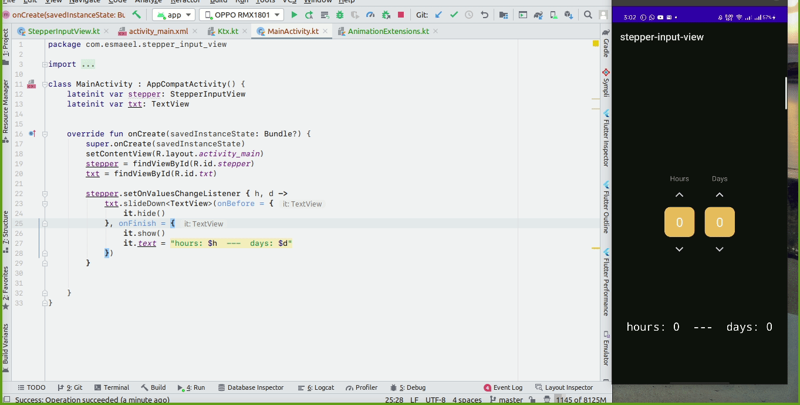

# Stepper-input-view
highly Customizable Stepper view.



## Including in your project
[](https://jitpack.io/#EsmaeelNabil/Stepper-input-view)
### Gradle 
Add below codes to your **root** `build.gradle` file (not your module build.gradle file).
```gradle
allprojects {
    repositories {
    	....
	maven { url 'https://jitpack.io' }
    }
}
```
And add a dependency code to your **APP**'s `build.gradle` file. [](https://jitpack.io/#EsmaeelNabil/Stepper-input-view)
```gradle
dependencies {
	  implementation 'com.github.EsmaeelNabil:Stepper-input-view:0.1'
}
```

## Usage

Add following XML inside your XML layout file.

### StepperInputView XML

``` xml
<com.esmaeel.stepper.StepperInputView
        android:id="@+id/stepper"
        android:layout_width="wrap_content"
        android:layout_height="wrap_content"
        app:cardBgColor="@color/yellow"
        app:dDownDrawable="@drawable/ic_down"
        app:dMax="20"
        app:dMin="0"
        app:dTitleText="Days"
        app:dTitleVisible="true"
        app:dUpDrawable="@drawable/ic_up"
        app:dValue="0"
        app:hDownDrawable="@drawable/ic_down"
        app:hMax="20"
        app:hMin="0"
        app:hTitleText="Hours"
        app:hTitleVisible="true"
        app:hUpDrawable="@drawable/ic_up"
        app:hValue="0"
        />

```

# implementaion

``` kotlin
class MainActivity : AppCompatActivity() {
    lateinit var stepper: StepperInputView
    lateinit var txt: TextView    
    override fun onCreate(savedInstanceState: Bundle?) {
        super.onCreate(savedInstanceState)
        setContentView(R.layout.activity_main)
        stepper = findViewById(R.id.stepper)
        txt = findViewById(R.id.txt)

        stepper.setOnValuesChangeListener { h, d ->
            txt.text = "hours: $h  ---  days: $d"
        }
    }
}
```


